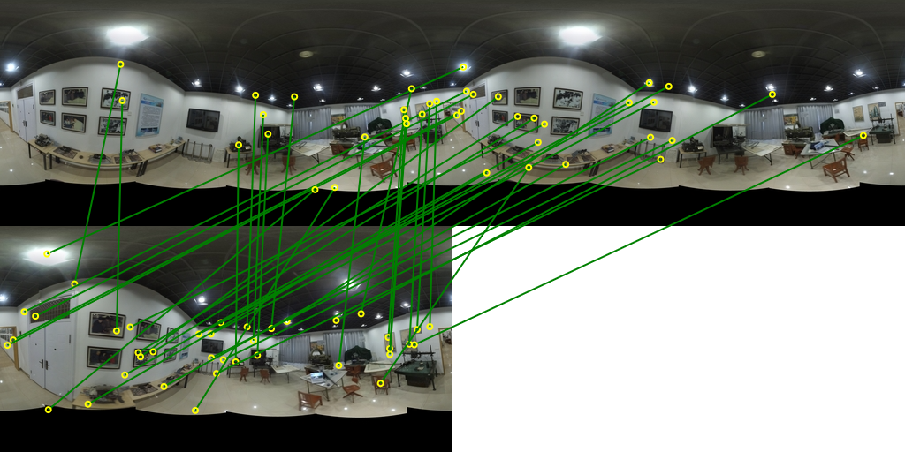

# ImageTools

Some code (vlfeat, image reading/writing) extracted from <https://github.com/colmap/colmap>.

-   ShiftImage：图像移位
    -   0~1
    -   +CenterPixel
    -   -LeftPixel
-   SiftMatch：特征匹配
-   PanoMatch：特征匹配（2），针对全景图

