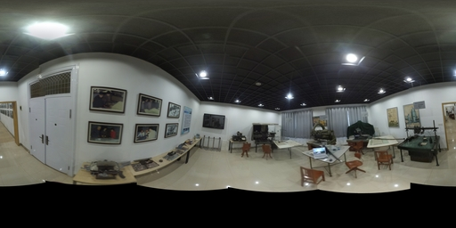

~~Mod based on <https://github.com/colmap/colmap>.~~

后来还是用了 OpenMVG。本目录下有 Windows 二进制：PanoMatch.exe。

比如有两张全景图：

site1.jpg:


site2.jpg:



处理：

```bash
$ ./PanoMatch.exe -t SIFT -a images/site1.jpg -b images/site2.jpg
0       4
1       4
2       5
3       3
4       3
5       0
6       3
7       7
8       5
9       5
10      0
11      0
12      0
13      0
14      0
15      0
16      0
17      0
18      0
19      0
20      0
21      0
22      0
23      0
24      0
25      0
26      0
27      0
28      0
29      0
30      0
31      0
32      0
33      0
34      0
35      0
223 #Features on image A
204 #Features on image B
39 #matches with Distance Ratio filter
```

结果：

00_images.jpg：


01_features.jpg：


02_Matches.svg：


